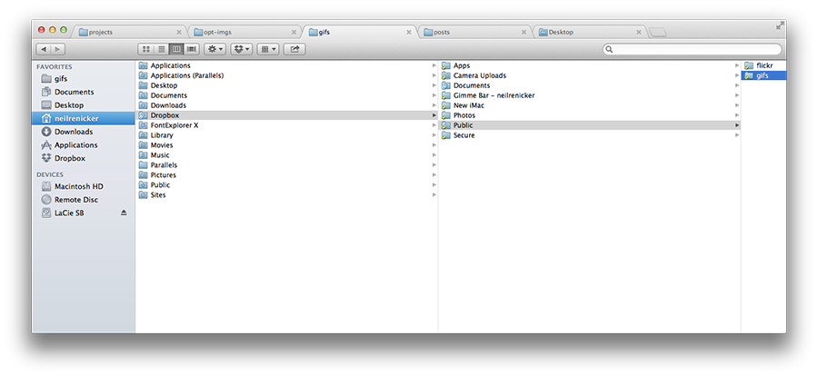

I recently had a little OS X Finder meltdown. I somehow had set my Finder columns to a very large width permanently; I could temporarily drag to resize the column width, but every time I opened a new Finder window, the columns would reset to be extremely wide again.

I lived with the annoyance for a long time because I couldn't find any preferences to set the default finder width. I finally discovered the (hidden) solution:

**Hold the `option/alt` key** while dragging to resize a Finder column width. Finder will remember that width for future windows.

Oh, and if you're wondering how I have those cool tabs in my Finder, look no further than the excellent [XtraFinder](http://www.trankynam.com/xtrafinder/). It's solid, and has lots of great keyboard shortcuts for powerusers—I can't imagine ever going back to OS X default finder.

Thanks to [a MacRumors user](http://forums.macrumors.com/showpost.php?p=3499315&postcount=5) for the tip.