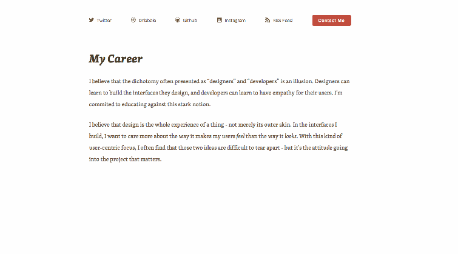
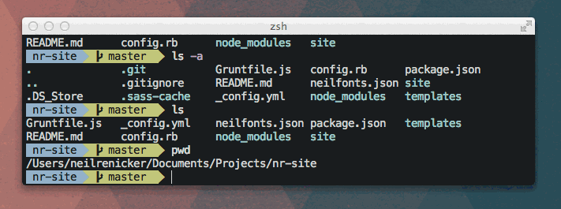
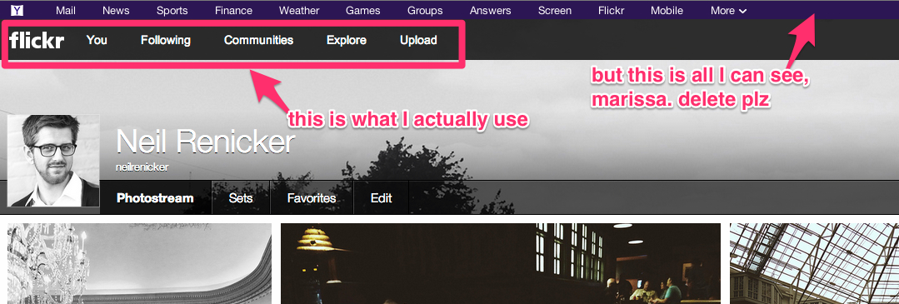

In a distributed workplace, and in online communication with clients, talking about design is difficult. Talking about animation and interaction in design is even more difficult. 

I've found that the best way to describe movement in interfaces is with *animated GIFs* and *annotated images*. I'll walk you quickly through how I make it happen.

## GIFs for a good cause

GIFs are good for more than showing [dumpster-diving bears](http://neilrenicker.com/img/posts/2013-10-23-bear-trash.gif) and [cute puppies](http://neilrenicker.com/img/posts/2013-10-23-cute-puppy.gif). Put them to work in lots of cool ways by recording stuff on your screen:

* Mock up faux Javascript animations by adding / removing class names in CSS, or switching Photoshop layers on and off
  
* Easily show visual bugs in interface interactions
* Record quick how-to's showing the process of performing a complicated programming or technical task
  

**How I do it:** I use [LICEcap](http://www.cockos.com/licecap/) for recording GIFs on my screen. It's free, it's simple to use, and it has a feature set that's just right. 

You'll never have to open Photoshop or a video-editing app. LICEcap simply outputs an animated GIF of a selected area of your screen.

## Ugly Annotations

Pictures and screenshots are valuable, but they become even more helpful when you write on them. Annotations need not be pretty. They just need to be easy to spot, and quick to digest.

* Point out exactly where a visual bug is happening on an interface
  
* Use circles and arrows to draw attention to stuff
* Quickly teach a technical task by scribbling steps on a screenshot

**How I do it:** I use [Skitch for Mac](http://evernote.com/skitch/) to make annotations. Skitch even has a hotkey (`⌘ + Shift + 5`) to take a screen grab and immediately open it in the app. Speed is the key here for me. Skitch is super fast, and has just a few simple features for adding bright, bold annotations to images.

Otherwise, you can use `⌘ + Shift + 4` (default in OS X) to take a screen grab and open it in the graphics program of your choice.

After I annotate with Skitch, I upload the image to [Cloud App](http://getcloudapp.com/) and share the link, or drag the image into a Github issue to display it inline. If Cloud App doesn't suite you, [Droplr](https://droplr.com/hello) is a worthy alternative.

## Use this stuff in Github issues and forum answers, please

Using these two simple communication tools will make your Github issues and forum answers like 500% better. Use them for that. The internet will thank you and you'll be my hero. Also, there's no reason you can't communicate this way in email, chat, and blog posts.